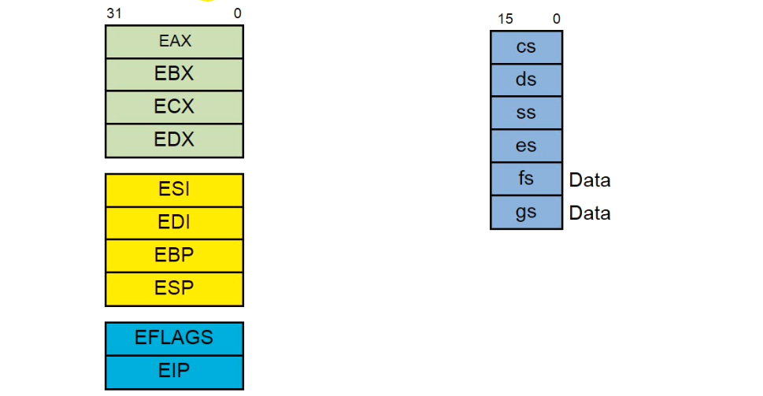

### History of x86 processors
#### Intel 8086 (1978)
- 1 MB addressable RAM (20 bit for addressing)
- 16-bit registers
- 16-bit data bus

#### Intel 8088 (1979)
- 1 MB addressable RAM (20 bit for addressing)
- 16-bit registers
- 8-bit data bus
- ~ 29000 transistors
- ~ 5 MHz - 10 MHz

#### Intel 80286 (1982)
- 16 MB addressable RAM (24 bit for addressing)
- protected memory
- introduced IDE bus architecture
- Up to 20MHz
- ~ 130,000 transistors / 6 MHz to 16 MHz


#### Intel 386 (1985)
- 4 GB addressable RAM (32 bit for addressing)
- 32-bit registers
- paging (virtual memory)
- Up to 33MHz


#### Intel 486 (1989)
- instruction pipelining
- 8KB cache (SRAM)
- more than 1 million transistor


#### Pentium (1992) 66 MHz - 3 M transistor - 32 bit addressable - 32 bit data inside
#### Pentium Pro (1995) - 150 MHz - 36 bit addressable
#### Pentium II (1997)
#### Pentium III (1999)
#### Pentium 4 (2000)
#### Pentium D (2005, Dual Core)


### 8086 and registers
- General register
  - **AX**: Accumulator register - 16 bit | AH (8 bit) + AL (8 bit)
  - **BX**: Base address register - 16 bit
  - **CX**: Count register - used in loops - 16 bit
  - **DX**: Data register - points to data in input/ output operations - 16 bit

- Segment Registers
  - **CS**: Code Segment register
  - **ES**: Extra Segment register
  - **SS**: Stack Segment register
  - **DS**: Data Segment register

**Note**: A segment is a block of main memory (maximum size of a segment 64KB - ranging from 1 byte up to 65,536 bytes).  
- Instruction Register
  - **IP**: Instruction Pointer register (**PC in MIPS**)

- Index Registers
  - **DI**: Destination Index register
  - **SI**: Source Index register
- Pointer Registers
  - **SP**: Stack Pointer register - used while working with stack
  - **BP**: Base Pointer register - used while working with stack
- Flag Register
  - **Flag Register**: indicating the current state of the processor

The following images [1](https://compsecurityconcepts.files.wordpress.com/2014/09/8086_blockdia.jpeg) [2](https://compsecurityconcepts.files.wordpress.com/2014/09/8086_segmem.jpeg) presents these registers and also segmented structure of the main memory in 8086 processor.


Being able to address a word in a segment, there is a offset value which is stored in a one of the registers of BX, SI, DI, BP. The following image shows this concept clearly.


Following example shows how we can get the physical address of a word in a specific segment from segment address and the offset.


### 32-bit registers
By introduction of i386, 32-bit registers were added to the architecture of the processors which can be viewed in the following image.



### Note on pipelining
Using pipeline method for increasing the performance of processors started to adopted from 8086. 8085 processor was a non-pipelined one.

### Basics
You can see the following codes by clicking on them. Use a emu8086 to see the registers and other states of the processor to gain a vision on how x86 processors work

#### 1 - [mov destination, source](01-basic-instructions/01-mov-instruction.asm)

#### 2 - [add destination, source](01-basic-instructions/02-add-instruction.asm)

#### 3 - [working with stack](01-basic-instructions/03-working-with-stack.asm)

#### 4 - Addressing Modes
##### 4 - 1 - register mode

```
mov ax, bx
```

##### 4 - 2 - immediate mode

```
mov ax, 01fa4h
```

##### 4 - 3 - direct mode

```
mov al, [1000]; logical address = DS:1000h | physical address = left shit DS + 1000h
```

##### 4 - 4 - register indirect

```
mov al, [bx]; logical address = DS:BX | physical address = left shift DS + value in BX register
```

##### 4 - 5 - base relative

```
mov ax, [bx] + 7; physical address = shift left DS + value in BX + 7

mov cl, [bp] + 4; physical address = shift left DS + value in BP + 4
```

##### 4 - 6 - indexed relative

```
mov dx, [si] + 8; physical address = shift left DS + value in SI + 8
```

##### 4 - 7 - based indexed relative

```
mov al, [bp][di] + 5; physical address = shift left DS + BP + DI + 5

mov bl, [bx][si] + 8; physical address = shift left DS + value in BX + value in SI + 8
```

#### 5 - Data types (Variables)
For declaring data in assembly code, there are five types as follows:
- DB: 1 Byte
- DW: 2 Byte
- DD: 4 Byte
- DQ: 8 Byte
- DT: 10 Byte

```
a   db  10101010b
b   db  35 ; 35 is decimal = 23h
c   db  42h

d   dw  1010101010101010b
e   dw  345
f   dw  5d12h
```
Note: if variables are defined like what we saw above, they are going to be stored in Code Segment (CS).


Note: constants can be defined with "equ" keyword. Also, they are not stored anywhere.

```
C   equ 3f12h
```

#### 6 - Basic assembly program samples
##### 1- [View here what is traditional in writing an assembly program](01-basic-instructions/04-sample1.asm)

##### 2 - [View here the simplified version of the previous one](01-basic-instructions/05-sample2.asm)

##### 3 - [Example of using loop for adding four numbers](01-basic-instructions/06-loop-for-adding.asm)

##### 4 - [Example of using for adding four numbers using BX:AX for the result](01-basic-instructions/07-adding-more.asm)

##### 5 - [Example of multiplying two bytes](01-basic-instructions/08-multiplying-two-bytes.asm)

##### 6 - [Example of multiplying two words](01-basic-instructions/../01-basic-instructions/09-multiplying-two-words.asm)

##### 7 - [Example of multiplying a byte and a word](01-basic-instructions/10-multiplying-byte-word.asm)

##### 8 - [Example of dividing a byte by another byte](01-basic-instructions/11-divide-byte-to-byte.asm)

##### 9 - [Example of dividing a word by another word](01-basic-instructions/12-divide-word-by-word.asm)

##### 10 - [Example of dividing a word by a byte](01-basic-instructions/13-divide-word-by-byte.asm)

##### 11 - [Example of logic instructions](01-basic-instructions/14-bit-operations.asm)

##### 12 - [Maximum of three number](01-basic-instructions/15-maximum.asm)

##### 13 - [If implementation in Assembly](01-basic-instructions/16-if-in-assembly.asm)

### BCD Numbers
